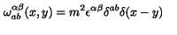
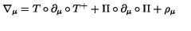
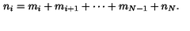

# unsloth-fine-tune-gemma-4

Worked examples of [Unsloth](https://github.com/unslothai/unsloth) on Gemma 4 E2B for causal inference, baselines, and Supervised Fine-Tuning (SFT) sweeps.

---

## Key Empirical Takeaways

Across three distinct text-only tasks (GSM8K math, Regex semantic parsing, and Emotion classification), **SFT on highly capable instruction-tuned LLMs (Gemma 4 E2B) consistently underperforms Zero-Shot baseline prompting**. We observed three distinct limiting dynamics:

1. **Supervised Alignment Tax (GSM8K Math)**:
   - The base E2B model achieves a very high zero-shot baseline of **84.00%** accuracy.
   - Fine-tuning on a narrow math dataset (GSM8K) degrades this baseline to **78.00%** (4-bit QLoRA SFT) or **80.00%** (full fp16 SFT). The model suffers a capability drop when forced to adapt its pre-trained instruct transitions to a narrow SFT split.
   - See [experiments.md](experiments.md) for the detailed math sweeps.

2. **The Generalization Bottleneck (NL-to-Regex)**:
   - The base model scores **2.00%** exact match (EM) accuracy zero-shot because it generates standard PCRE regexes (like `^[^e]*$`), while the dataset targets a custom logical **LRegex** dialect (`~(.*e.*)`).
   - SFT training successfully overfit the training split (collapsing SFT loss to $0.198$). However, when evaluated on held-out test prompts, the SFT model scored **0.00%** accuracy.
   - SFT on a small dataset (724 rows) acts as a memorization cache; the QLoRA adapter lacks the semantic capacity to synthesize and generalize a completely new logical grammar syntax to unseen prompts. Consequently, the base model's massive pre-trained PCRE regex prior dominates.
   - See [experimental/README.md](experimental/README.md) for the Regex study.

3. **Human Annotator Benchmark Noise (Emotion Classification)**:
   - The base model achieved a baseline of **54.00%** accuracy on the `dair-ai/emotion` dataset, which shifted slightly to **56.00%** after SFT.
   - Manual trace audits revealed that the model's "mismatches" were actually highly logical, conceptually correct classifications (e.g., mapping `"i feel so cold"` to `sadness` instead of the gold label `anger`, or `"friendly affection"` to `love` instead of the gold label `joy`).
   - Because E2B maintains a rigid pre-trained semantic logic under gentle SFT, it refuses to overfit to noisy, inconsistent human annotations, limiting its exact-match accuracy improvement.
   - See [experimental/README.md](experimental/README.md) for the Emotion study.

---

## Hardware Requirements

* **NVIDIA GPU with at least 16 GB of VRAM is required**.
  - **Base Inference**: 4-bit E2B requires **8.3 GB**, and 16-bit fp16 E2B requires **10.3 GB** of VRAM.
  - **SFT LoRA/QLoRA Training**: Standard 16-bit full-precision SFT adapter training requires **11.7 GB** of VRAM.
  - Triton compiler memory overhead during kernel warmup requires the remaining VRAM headroom. This repo has been tested and benchmarked on a single **NVIDIA GeForce RTX 4090 (24 GB VRAM)**.

---

## Getting Started

### 1. Environment Setup

We use `uv` for virtual environment and dependency management.

```bash
# 1. Create virtual environment and sync dependencies
uv sync

# 2. Authenticate Hugging Face CLI to download gated weights
uv run hf auth login

# 3. Download the E2B model directly into the shared HF cache (~/.cache/huggingface)
HF_HUB_ENABLE_HF_TRANSFER=1 uv run hf download unsloth/gemma-4-E2B-it-unsloth-bnb-4bit
```

### 2. Causal Inference Smoke Test

Ensure the base model streams completions successfully:

```bash
uv run python examples/inference.py
```
*Expectation*: Streams the answer to *"What is the capital of France?"*. Pass `--prompt "..."` or `--model <hf-id>` to customize.

---

## Reproducing the Results

All SFT training scripts and systematic evaluators are fully structured and parameterized as CLI flags.

### 1. GSM8K Causal Math Evals
To reproduce our baseline and QLoRA math adapter sweeps:

```bash
# A. Run base model baseline (N=50)
uv run python examples/eval_gsm8k_automated.py --num-examples 50

# B. Train 4-bit QLoRA adapter (r=32, LR 2e-5, cosine scheduler)
uv run python examples/finetune_gsm8k.py \
  --max-steps 200 \
  --train-rows 2000 \
  --lora-rank 32 \
  --lora-alpha 32 \
  --learning-rate 2e-5 \
  --warmup-steps 20 \
  --lr-scheduler-type cosine \
  --output-dir lora_gsm8k_4b_s3

# C. Evaluate the trained 4-bit adapter
uv run python examples/eval_gsm8k_automated.py --adapter lora_gsm8k_4b_s3/ --num-examples 50

# D. Train full-precision (16-bit) adapter
uv run python examples/finetune_gsm8k.py \
  --model unsloth/gemma-4-E2B-it \
  --no-4bit \
  --max-steps 200 \
  --train-rows 2000 \
  --lora-rank 32 \
  --lora-alpha 32 \
  --learning-rate 2e-5 \
  --warmup-steps 20 \
  --lr-scheduler-type cosine \
  --output-dir lora_gsm8k_fp16_s1

# E. Evaluate the trained 16-bit adapter
uv run python examples/eval_gsm8k_automated.py --adapter lora_gsm8k_fp16_s1/ --no-4bit --num-examples 50
```

### 2. Regex and Emotion Evals (Experimental Folder)
To reproduce our Custom Syntax and Semantic classification sweeps, navigate to the `experimental/` directory. See [experimental/README.md](experimental/README.md) for exact commands and execution instructions.

### 3. Multimodal LaTeX OCR SFT (RTX 4090)
To reproduce our peak-performing high-capacity LaTeX OCR visual tuning benchmarks:

```bash
# A. Run zero-shot base model baseline (N=50)
uv run python examples/eval_vision.py --model unsloth/gemma-4-E2B-it --no-4bit --eval-rows 50 --vision-tokens 280

# B. Train 16-bit fp16 SFT peak-LoRA adapter (r=32, alpha=64, LR 5e-5, 280 tokens)
uv run python examples/finetune_vision.py \
  --model unsloth/gemma-4-E2B-it \
  --no-4bit \
  --lora-rank 32 \
  --lora-alpha 64 \
  --learning-rate 5e-5 \
  --vision-tokens 280 \
  --max-steps 60 \
  --output-dir lora_vision_best

# C. Evaluate the trained SFT adapter
uv run python examples/eval_vision.py --model lora_vision_best/ --no-4bit --eval-rows 50 --vision-tokens 280

# D. Merge LoRA adapters back into base weights to produce a 16-bit safetensors directory
uv run python examples/merge_lora.py --adapter lora_vision_best --output-dir lora_vision_merged_fp16

# E. Run streaming formula inference on a sample local image using the merged standalone safetensors
uv run python examples/inference.py --model lora_vision_merged_fp16/
```

#### Qualitative Fine-Tuning Delta (Before vs. After SFT):

Fine-tuning on standard display math delimiters successfully stabilizes structural alignments, maps correct operators, and extracts visual details:

##### 1. Visual Symbol Resolution (Alpha vs. English 'a')

*   **Input Image**: 
    
*   **Expected Ground Truth (GT) & SFT Output**:
    ```latex
    \omega _ { a b } ^ { \alpha \beta } ( x , y ) = m ^ { 2 } \epsilon ^ { \alpha \beta } \delta ^ { a b } \delta ( x - y )
    ```
    *Rendered Terminal Math (TeXicode)*:
    ```math
     ωᵅᵝ(x,y)=m²ϵᵅᵝδᵃᵇδ(x-y)
      ᵃᵇ
    ```
*   **BEFORE SFT (Zero-Shot Base Model)**:
    ```latex
    \omega_{ab}^{a\beta}(x,y) = m^2 \epsilon^{a\beta} \delta^{ab} \delta(x-y)
    ```
    *Rendered Terminal Math (TeXicode)*:
    ```math
     ωᵃᵝ(x,y)=m²ϵᵃᵝδᵃᵇδ(x-y)
      ᵃᵇ
    ```
    *Baseline Error*: Due to a visual feature extraction bottleneck at standard resolution, the base model missed the loop curvatures of the Greek letter `\alpha` (alpha) in `\omega` and `\epsilon` superscripts, misinterpreting them as standard English `a` letters (`a\beta` and `a\beta` superscripts).
    *SFT Correction*: Successfully aligned local pixel layouts to correctly resolve the Greek mathematical letters, transcribing the formula perfectly while cleanly shifting standard delimiters.

##### 2. Detail Omission Prevention (Compose Circle `\circ`)

*   **Input Image**: 
    
*   **Expected Ground Truth (GT) & SFT Output**:
    ```latex
    \text{\nabla} _ { \mu } = T \circ \partial _ { \mu } \circ T ^ { + } + \Pi \circ \partial _ { \mu } \circ \Pi + \rho _ { \mu }
    ```
    *Rendered Terminal Math (TeXicode)*:
    ```math
     ∇ =T∘∂ ∘T⁺+Π∘∂ ∘Π+ρ
      μ    μ       μ    μ
    ```
*   **BEFORE SFT (Zero-Shot Base Model)**:
    ```latex
    \text{\nabla}_{\mu} = T \circ \partial_{\mu} T^{+} + \Pi \circ \partial_{\mu} \Pi + \rho_{\mu}
    ```
    *Rendered Terminal Math (TeXicode)*:
    ```math
     ∇ =T∘∂ T⁺+Π∘∂ Π+ρ
      μ    μ      μ   μ
    ```
    *Baseline Error*: The base model omitted two crucial mathematical compose operators (`\circ` circle indicators) right before `T^{+}` and `\Pi` terms, rendering the formula incomplete.
    *SFT Correction*: Retained high-fidelity feature tracking, capturing all compose operators exactly.

##### 3. Mathematical Syntax Alignment (`\cdots` vs. `\dots`)

*   **Input Image**: 
    
*   **Expected Ground Truth (GT) & SFT Output**:
    ```latex
    n _ { i } = m _ { i } + m _ { i + 1 } + \cdots + m _ { N - 1 } + n _ { N } .
    ```
    *Rendered Terminal Math (TeXicode)*:
    ```math
     n\textsubscript{i}=m\textsubscript{i}+m\textsubscript{i}\textsubscript{₊}\textsubscript{₁}+⋯+m\textsubscript{N}\textsubscript{₋}\textsubscript{₁}+n\textsubscript{N}
    ```
*   **BEFORE SFT (Zero-Shot Base Model)**:
    ```latex
    n_i = m_i + m_{i+1} + \dots + m_{N-1} + n_N.
    ```
    *Rendered Terminal Math (TeXicode)*:
    ```math
     n\textsubscript{i}=m\textsubscript{i}+m\textsubscript{i}\textsubscript{₊}\textsubscript{₁}+…+m\textsubscript{N}\textsubscript{₋}\textsubscript{₁}+n\textsubscript{N}
    ```
    *Baseline Error*: Transcribed handwritten horizontal dots (dots of omission) using raw text `\dots` conventions (rendered as lower aligned dots `…`).
    *SFT Correction*: Standardized predictions to use centered math dots (`\cdots` centered vertical layout `⋯`), conforming exactly to dataset annotations.

---

## Repository Structure

```
.
├── pyproject.toml                  # uv dependency definitions
├── experiments.md                  # Structured GSM8K results, findings & sweeps table
├── latex_ocr_experiments.md        # Complete Master 50-run sweeps and 1-Epoch results for LaTeX OCR
├── README.md                       # Upfront takeaways, hardware bounds & reproduction index
├── latex_ocr/                      # Sequential sweeps coordinator and researcher tools package
│   ├── run_master_sweeps.py        # Sequential sweeps trainer + evaluator
│   ├── run_full_epoch_sequel.py    # sequel scaled full epoch tuner
│   └── inspect_processor.py        # processor structures and token budgets analyzer
├── examples/
│   ├── inference.py                # Base model and merged safetensors formula inference text
│   ├── finetune_gsm8k.py           # GSM8K QLoRA and fp16 trainer
│   ├── finetune_vision.py          # LaTeX OCR multimodal fp16 trainer (epochs-limit compatible)
│   ├── eval_vision.py              # High-precision greedy EM/NED validation evaluator (N=50)
│   ├── merge_lora.py               # high-precision fp16 LoRA merging standalone safetensors tool
│   ├── sample_1.png                # visual Greek alpha superscript target image
│   ├── sample_2.png                # visual compose circle omission target image
│   ├── sample_3.png                # visual centered dots token alignment target image
│   ├── eval_gsm8k_automated.py     # Regex-based automated parser v3 evaluator (N=50)
│   └── eval_gsm8k.py               # original manual 3-example validation helper
└── experimental/
    ├── README.md                   # Unified design, findings and tables for Regex & Emotion tasks
    ├── train_regex.py              # High-LR QLoRA regex trainer
    ├── eval_regex.py               # Markdown-extracting regex EM evaluator
    ├── train_emotion.py            # QLoRA SFT trainer with response masking
    └── eval_emotion.py             # Multi-tier fallback keyword emotion evaluator
```
