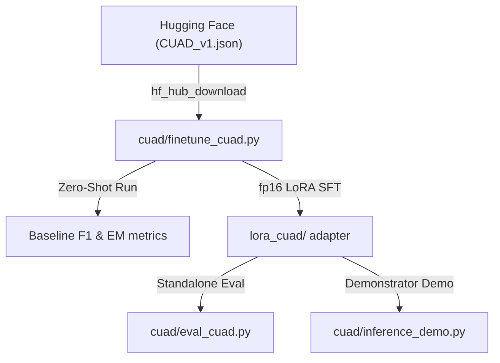

# Implementation Plan: CUAD Legal LoRA SFT (Gemma 4 E2B FP16)

Establish a complete parameter-efficient SFT pipeline for contract clause extraction inside the workspace in the namespace `cuad/`.

The execution config, data structures, and sweeps are explicitly optimized for systems featuring **16–24 GB of VRAM** utilizing full **fp16** precision SFT using **Gemma 4 E2B**.

---

## User Review Required

> [!NOTE]
> **Hardware Context & Execution Precision**: 
> This design adopts full **16-bit precision** (FP16 / BF16) training. We target `unsloth/gemma-4-E2B-it` loaded in high-fidelity mode (`load_in_4bit=False`). The entire training loop peaks safely within the **24 GB VRAM** limits.

---

## Proposed Changes

All pipeline logic is housed inside the newly established, isolated directory `cuad/`.

### Component: CUAD Namespace



#### [NEW] [finetune_cuad.py](file:///usr/local/google/home/advaitjain/github/unsloth-fine-tune-gemma-4/cuad/finetune_cuad.py)
Core fine-tuning pipeline orchestration.
1.  **Model & Precision Setup**: Loads unsloth's `unsloth/gemma-4-E2B-it` with `load_in_4bit=False`.
2.  **Data Alignment (Governing Law)**: Slices compact 256-character offset snippet chunks centered surrounding exact gold bounds to isolate focused legal queries.
3.  **LoRA Parameters**: Standard best practices: Rank $r=16$, alpha $\alpha=32$ ($2x$ rank), learning rate $lr=10^{-4}$.
4.  **Masked turns**: Since Gemma 4 is used, utilizes standard `<|turn>user\n` and `<|turn>model\n` tokens for question masking.
5.  **Zero-Shot Evaluation (Before)**: Greedy evaluations on the 50 evaluation examples and calculating baseline metrics (Normalized Exact Match and token F1 overlap).
6.  **Full fp16 Training**: Performs parameter updates over the 300 train snippets (approx. 60–160 steps).
7.  **Post-Fine-Tuning evaluation (After)**: Evaluates the same validation list, compiles comparative outputs, logs standard metrics improvement, and stores standard LoRA weights.

#### [NEW] [eval_cuad.py](file:///usr/local/google/home/advaitjain/github/unsloth-fine-tune-gemma-4/cuad/eval_cuad.py)
Greedy decoding metric computer. Reloads `unsloth/gemma-4-E2B-it` and standard `lora_cuad/` weights to compute statistics or sweeps on custom validation files.

#### [NEW] [inference_demo.py](file:///usr/local/google/home/advaitjain/github/unsloth-fine-tune-gemma-4/cuad/inference_demo.py)
A simplified demonstrator demo file that contains **5 explicit validation segments** where SFT establishes a clear format and semantic capability output correction over zero-shot outputs. Anyone can trigger this CLI script directly:
```bash
uv run python cuad/inference_demo.py --adapter lora_cuad/
```
It outputs:
- The input text.
- The base model zero-shot generation.
- The fine-tuned SFT generation.
- The absolute gold target.
This allows reviewers to instantly audit the exact structural improvements.

#### [NEW] [experiments.md](file:///usr/local/google/home/advaitjain/github/unsloth-fine-tune-gemma-4/cuad/experiments.md)
A detailed audit file documenting the initial performance parameters, baseline results, post-tuning scores, metric transformations, visual logs of improvements, and lessons learned.

---

## Hyperparameter Sweeps Design

To study the effects of steps decay schedules and high precision capacity boundaries, a structured parameter sweep of **10 experiments** is organized:

| Exp ID | Goal | Rank ($r$) | Alpha ($\alpha$) | LR ($lr$) | Scheduler | Steps |
| :--- | :--- | :---: | :---: | :---: | :---: | :---: |
| **EXP_1** | **Baseline Control** | **16** | **32** | **$1\times10^{-4}$** | **Linear** | **80** |
| **EXP_2** | Low-LR Base | 16 | 32 | $2\times10^{-5}$ | Linear | 80 |
| **EXP_3** | High-LR Base | 16 | 32 | $2\times10^{-4}$ | Linear | 80 |
| **EXP_4** | Cosine Baseline | 16 | 32 | $1\times10^{-4}$ | Cosine | 80 |
| **EXP_5** | Cosine + Mid steps | 16 | 32 | $1\times10^{-4}$ | Cosine | 120 |
| **EXP_6** | Cosine + Max steps | 16 | 32 | $1\times10^{-4}$ | Cosine | 160 |
| **EXP_7** | Capacity Rank Base | 32 | 64 | $1\times10^{-4}$ | Cosine | 80 |
| **EXP_8** | Capacity Rank + Mid steps | 32 | 64 | $1\times10^{-4}$ | Cosine | 120 |
| **EXP_9** | Capacity Rank + Max steps | 32 | 64 | $1\times10^{-4}$ | Cosine | 160 |
| **EXP_10**| Max step, LR and Cosine | 16 | 32 | $2\times10^{-4}$ | Cosine | 160 |

All comparative findings, Normalized EM and F1 transitions will be detailed in `cuad/experiments.md`.

---

## Verification Plan

### Execution Instructions

1.  **AST Parse Check**:
    ```bash
    uv run python -c "import ast; ast.parse(open('cuad/finetune_cuad.py').read()); print('Finetune: OK')"
    uv run python -c "import ast; ast.parse(open('cuad/eval_cuad.py').read()); print('Eval: OK')"
    ```

2.  **Hugging Face Hub Pre-Cache**:
    ```bash
    HF_HUB_ENABLE_HF_TRANSFER=1 uv run hf download unsloth/gemma-4-E2B-it
    ```

3.  **Scale Verification (Smoke check)**:
    ```bash
    uv run python cuad/finetune_cuad.py --max-steps 5 --eval-rows 5 --no-4bit --output-dir /tmp/lora_cuad_fp16_smoke
    ```

4.  **Sweep Executions examples**:
    ```bash
    # EXP_1 (Baseline)
    uv run python cuad/finetune_cuad.py --lora-rank 16 --lora-alpha 32 --learning-rate 1e-4 --output-dir cuad/lora_exp1
    
    # EXP_6 (Max Steps with Cosine)
    uv run python cuad/finetune_cuad.py --lora-rank 16 --lora-alpha 32 --learning-rate 1e-4 --lr-scheduler-type cosine --max-steps 160 --output-dir cuad/lora_exp6
    ```

5.  **Auditing Improvements**:
    ```bash
    uv run python cuad/inference_demo.py --adapter cuad/lora_exp1/
    ```
