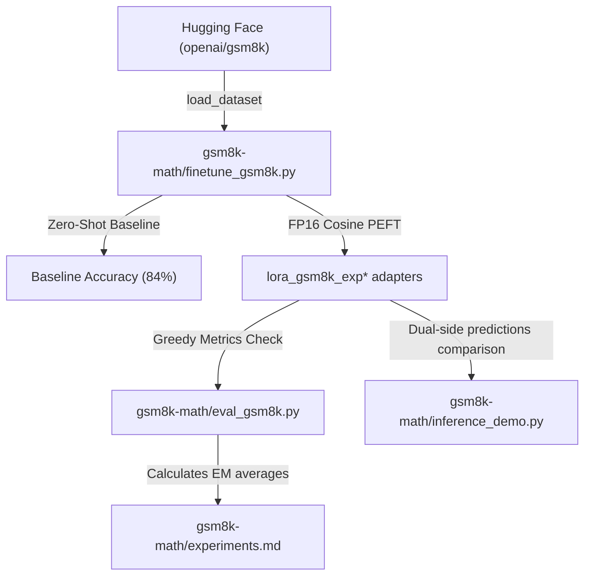

# Implementation Plan: GSM8K-Math LoRA SFT Sweeps

Establish a parameter-efficient, multi-config SFT search pipeline inside the namespace `gsm8k-math/` to sweep hyperparameter dimensions.

The search objective is: **Determine if full-precision FP16 SFT adapters sweeps can outperform zero-shot Instruct baselines (84.00% accuracy floor)** using unquantized `unsloth/gemma-4-E2B-it` and FA2/xformers.

---

## User Review Required

> [!NOTE]
> **Execution Environment**:
> All validation runs assume standard **24 GB VRAM** (NVIDIA RTX 4090) environment. The entire pipeline loads in raw **16-bit precision** (FP16 / BF16), bypassing 4-bit quantization noise, with max sequences capped at 2048.

---

## Proposed Changes

All components, metrics sheet, plans, and verification routines are located in the isolated directory `gsm8k-math/`.

### Component: GSM8K Sweeps Namespace



#### [NEW] [finetune_gsm8k.py](file:///usr/local/google/home/advaitjain/github/unsloth-fine-tune-gemma-4/gsm8k-math/finetune_gsm8k.py)
Core fine-tuning pipeline orchestration.
1.  Loads unsloth's `unsloth/gemma-4-E2B-it` with `load_in_4bit=False`.
2.  Applies standard Chat template formatting over math queries datasets.
3.  Executes standard before-eval baseline checks (using **100 held-out problems**, calculating average correct EM using regular expression backtracking checks).
4.  Applies custom target adapter parameters config.
5.  Toggles optimized masked training: Gemma 4 Instruction `<|turn>user\n` and Response `<|turn>model\n` turn markers.
6.  Performs fp16 training with high precision parameters.
7.  Executes standard SFT validations, calculates accuracy progress delta, and saves learned weights.

#### [NEW] [eval_gsm8k.py](file:///usr/local/google/home/advaitjain/github/unsloth-fine-tune-gemma-4/gsm8k-math/eval_gsm8k.py)
Offline metric computer. Loads a saved PEFT math adapter, runs greedy inference on the **100 held-out validations**, processes backtrack calculations isolate answer regexes, and outputs stats.

#### [NEW] [inference_demo.py](file:///usr/local/google/home/advaitjain/github/unsloth-fine-tune-gemma-4/gsm8k-math/inference_demo.py)
A comparative visual demonstrator script.
1. Loads validation split dataset inputs in full 16-bit precision.
2. Targets **5 explicit evaluated math problems** where SFT and zero-shot model predictions exhibit meaningful differences (e.g. base models getting confused on calculations net terms or rambling, and SFT outputting exactly the correct logic).
3. Dynamic reload: loads base model first, runs zero-shot, purges VRAM cache, reloads learned PEFT adapter, runs generations, and compiles formatted comparisons to demonstrate visual improvements directly.

#### [NEW] [experiments.md](file:///usr/local/google/home/advaitjain/github/unsloth-fine-tune-gemma-4/gsm8k-math/experiments.md)
Statistical workbook dashboard sheet.
> [!IMPORTANT]
> **Tabular Metrics Standards**: 
> All 18 hyperparameter experiments sweeps outcomes—including exact match baseline accuracy, final optimized accuracy progress, optimization loss, parameter sizes, and schedules—MUST be captured within a structured Markdown results comparison table inside `gsm8k-math/experiments.md`.

---

## Systematic sweeps design: 18 hyperparameter configurations

All experiments standardly compile using: **`unsloth/gemma-4-E2B-it`**, **FP16 loading**, **Cosine learning decay scheduler**, and **Warmup=20 steps**.

*   **Group A: R=32, Alpha=64 ($\alpha=2x$ Rank) dimensional shifts**:
    *   **EXP_1**: Rank 32, LR $5\times10^{-5}$, Train Rows 1500, Steps 100
    *   **EXP_2**: Rank 32, LR $5\times10^{-5}$, Train Rows 3000, Steps 200
    *   **EXP_3**: Rank 32, LR $5\times10^{-5}$, Train Rows 5000, Steps 300
    *   **EXP_4**: Rank 32, LR $1\times10^{-4}$, Train Rows 1500, Steps 100
    *   **EXP_5**: Rank 32, LR $1\times10^{-4}$, Train Rows 3000, Steps 200
    *   **EXP_6**: Rank 32, LR $1\times10^{-4}$, Train Rows 5000, Steps 300

*   **Group B: R=64, Alpha=128 ($\alpha=2x$ Rank) dimensional shifts**:
    *   **EXP_7**: Rank 64, LR $5\times10^{-5}$, Train Rows 1500, Steps 100
    *   **EXP_8**: Rank 64, LR $5\times10^{-5}$, Train Rows 3000, Steps 200
    *   **EXP_9**: Rank 64, LR $5\times10^{-5}$, Train Rows 5000, Steps 300
    *   **EXP_10**: Rank 64, LR $1\times10^{-4}$, Train Rows 1500, Steps 100
    *   **EXP_11**: Rank 64, LR $1\times10^{-4}$, Train Rows 3000, Steps 200
    *   **EXP_12**: Rank 64, LR $1\times10^{-4}$, Train Rows 5000, Steps 300

*   **Group C: Extended steps & control comparison shifts**:
    *   **EXP_13**: Rank 64, LR $5\times10^{-5}$, Train Rows 3000, Steps 300 (Extended steps)
    *   **EXP_14**: Rank 64, LR $1\times10^{-4}$, Train Rows 3000, Steps 300 (Extended steps)
    *   **EXP_15**: Rank 32, LR $2\times10^{-5}$, Train Rows 5000, Steps 300 (Stable control checks)
    *   **EXP_16**: Rank 32, LR $1\times10^{-5}$, Train Rows 1500, Steps 100 (Low LR checks)
    *   **EXP_17**: Rank 32, LR $1\times10^{-5}$, Train Rows 3000, Steps 200 (Low LR checks)
    *   **EXP_18**: Rank 32, LR $1\times10^{-5}$, Train Rows 5000, Steps 300 (Low LR checks)

---

## Verification Plan

### Execution Commands

1.  **AST check (Compile validation check)**:
    ```bash
    uv run python -c "import ast; ast.parse(open('gsm8k-math/finetune_gsm8k.py').read()); print('Math SFT: OK')"
    uv run python -c "import ast; ast.parse(open('gsm8k-math/eval_gsm8k.py').read()); print('Math Eval: OK')"
    ```

2.  **Mini-Smoke convergence verification (VRAM/Logic checks)**:
    ```bash
    uv run python gsm8k-math/finetune_gsm8k.py --max-steps 5 --train-rows 20 --eval-rows 5 --output-dir /tmp/lora_gsm8k_math_smoke
    ```

3.  **Executing sweeps runs (Examples)**:
    ```bash
    # EXP_1 (Rank 32 baseline)
    uv run python gsm8k-math/finetune_gsm8k.py --lora-rank 32 --lora-alpha 64 --learning-rate 5e-5 --train-rows 1500 --max-steps 100 --output-dir gsm8k-math/lora_exp1 --eval-rows 100
    
    # EXP_9 (Rank 64 peak steps SFT)
    uv run python gsm8k-math/finetune_gsm8k.py --lora-rank 64 --lora-alpha 128 --learning-rate 5e-5 --train-rows 5000 --max-steps 300 --output-dir gsm8k-math/lora_exp9 --eval-rows 100
    ```
